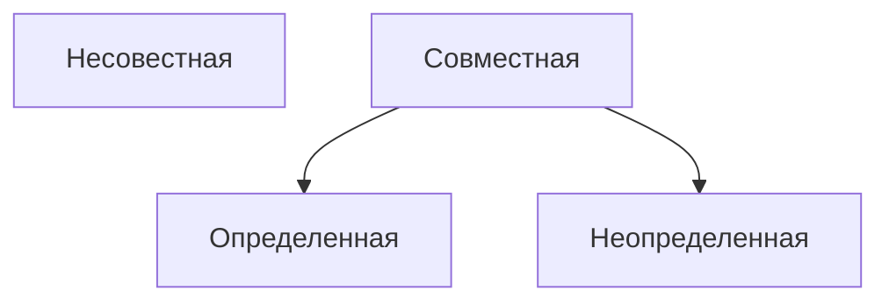

# Ранг матрицы
**Рангом матрицы** называется наибольший из порядков отличных от нуля и ее миноров
[Справка](http://www.mathprofi.ru/rang_matricy.html)

# Метод окаймляющих миноров
Пусть $M_k$ минор $k$-го порядка матрицы $A$. Окаймляющим минором для минора $M_k$ называется любой минор к которому добавили одну строку и один столбец, не входящие в минор $M_k$.

--------
# Системы линейных уравнений

$$
\begin{array}{c}
a_{11}x_1 + a_{12}x_2 + \dots + a_{1k}x_k + a_{1n}x_n = b_1 \\\ 
a_{21}x_1 + a_{22}x_2 + \dots + a_{2k}x_k + a_{2n}x_n = b_2 \\\ 
a_{31}x_1 + a_{32}x_2 + \dots + a_{3k}x_k + a_{3n}x_n = b_3 \\\ 
\end{array}
$$
**Совместная система уравнений** имеет решение
**Несовместная система уравнений** не имеет решение

**Совместная система линейных уравнений** называется **определенной** если она имеет единственное решение и **неопределенной** в противном случае.

Преобразования приводящие систему в равносильную ей
- перемена местами двух любых уравнений
- умножение обеих частей любого из уравнений на произвольное число, отличное от нуля.
- прибавление к обеим частям одного из уравнений соответствующий частей другого уравнения умноженных на вещественное число

---
# Теорема Кронекера-Капелли
Для того чтобы система линейных уравнений была совместной достаточно чтобы ранг матрицы системы был равен рангу расширенной матрицы.

**Расширенная матрица** получается из матрицы системы добавлением столбца свободных членов уравнений.
Если ранги матриц $A$ и $(A|B)$ равны числу неизвестных, система уравнений имеет единственное решение.
Если ранги матриц равны между собой и меньше числа неизвестных, то система совместная но не определенная.

