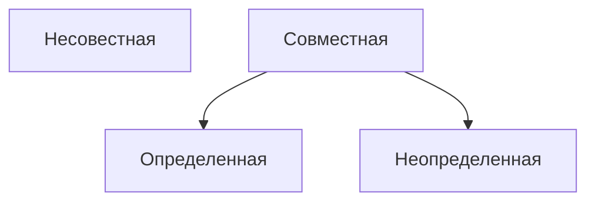

# Метод Гаусса

**Рангом матрицы** называется наивысший порядок отличных от нуля миноров этой матрицы

Свойства ранга матрицы
- $\text{rang} \le min(m; n)$ при размерах матрицы $m * n$
- $\text{rang}(A) = 0$ тогда, когда все элементы матрицы равны 0
- Если матрицы $A$ - квадратная порядка $n$, то $\text{rang}(A) = n$ тогда, когда $|A| \neq 0$

Преобразования не меняющие ранга матрицы
- Отбрасывание нулевой строки (столбца)
- Умножение всех элементов строки (столбца) матрицы на число не равное нулю
- Изменение порядка строк (столбцов)
- Сложение строк (столбцов)
- Транспонирование матрицы

--------

Для решение системы методом Гаусса понадобится расширенная матрица $A|B$ которая состоит из коэффициентов при $x$ и столбца свободных членов.
Если все свободные члены равны нулю, то система называется **однородной**, в противном случае **неоднородной**.

Пример:

![[Безымянный-2023-09-27-0918.png]]
Пример:
![[Безымянный-2023-09-27-0950.png]]

-----
# Дальнейшее решение

**Базисными** переменными можно выбрать только те, у столбцов которых миноры не равны нулю.
Остальные переменные называются **свободными**, они при дальнейшем решении заменяются на константы $C_1, C_2 \dots C_n$

Дальше разбиваем матрицу, например, ответ $\begin{pmatrix} 9-4C_2+C_1 \\\ \frac 5 2 +C_1 - \frac 1 2 C_2 \\\ C_1 \\\ C_2\end{pmatrix}$
Частное решение неоднородного (просто числа без $C$) - $\begin{pmatrix} 9 \\\ \frac 5 2 \\\ 0 \\\ 0\end{pmatrix}$
Общее решение однородного $C_1 \begin{pmatrix} 0 \\\ 1 \\\ 1 \\\ 0\end{pmatrix} + C_2 \begin{pmatrix} -4 \\\ - \frac 1 2 \\\ 0 \\\ 1\end{pmatrix}$
Фундаментальная система решений - $\{\begin{pmatrix} 0 \\\ 1 \\\ 1 \\\ 0\end{pmatrix} * \begin{pmatrix}  -4 \\\ -\frac 1 2 \\\ 0 \\\ 1\end{pmatrix}\}$

