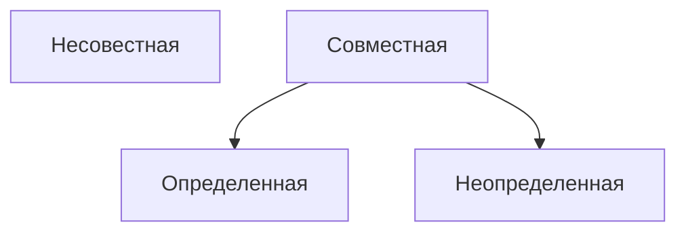

# Метод Гаусса

**Рангом матрицы** называется наивысший порядок отличных от нуля миноров этой матрицы

Свойства ранга матрицы
- $\text{rang} \le min(m; n)$ при размерах матрицы $m * n$
- $\text{rang}(A) = 0$ тогда, когда все элементы матрицы равны 0
- Если матрицы $A$ - квадратная порядка $n$, то $\text{rang}(A) = n$ тогда, когда $|A| \neq 0$

Преобразования не меняющие ранга матрицы
- Отбрасывание нулевой строки (столбца)
- Умножение всех элементов строки (столбца) матрицы на число не равное нулю
- Изменение порядка строк (столбцов)
- Сложение строк (столбцов)
- Транспонирование матрицы

--------

Для решение системы методом Гаусса понадобится расширенная матрица $A|B$ которая состоит из коэффициентов при $x$ и столбца свободных членов.
Если все свободные члены равны нулю, то система называется **однородной**, в противном случае **неоднородной**.

Пример:

![[Безымянный-2023-09-27-0918.png]]
Пример:
![[Безымянный-2023-09-27-0950.png]]
