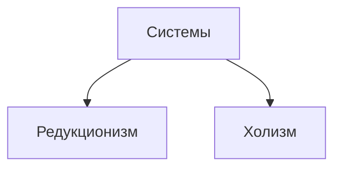
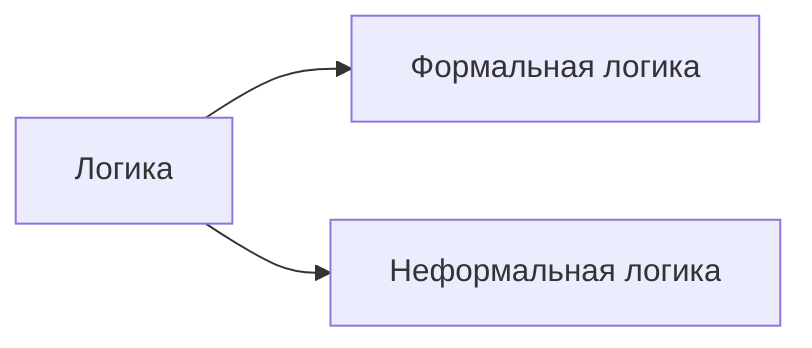
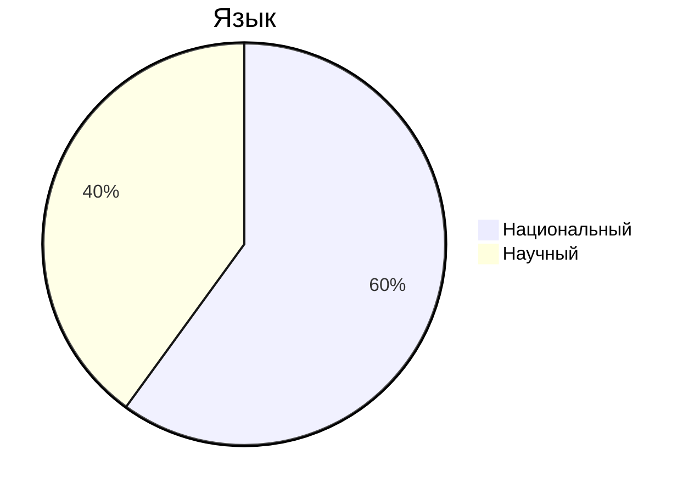
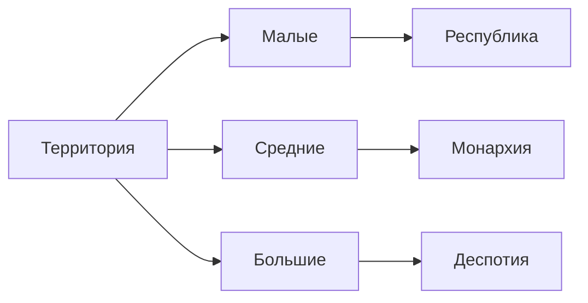

Зубков Николай Андреевич
zubkov@mirea.ru

Россия - сложная соц. полит. система
Люди - элементы этой системы

Редукционизм - система имеет свойство каждого элемента
Холизм - есть свойства, которых нет у элементов

Россия - холизм

-------
Теоретические знания

1) Логика (неформальная)
2) Рациональность (научная рациональность)
3) Язык 

---
## Термины
1) Страна
2) Государство
Страна и государство не являются синонимами в научном ключе.
Страна = государство(политика, право) + территория + люди
Страна - 
- История
- Культура
- Генезис
Территория - климат, место, ресурсы

---
Географический подход (географический детерминизм): соц, культурные и прочие особенности можно объяснить при помощи географических факторов.
Монтескье XVIII: Как география объясняет политику
Страны можно разделить по размеру: малые, средние, большие

- В малых государствах мало людей, все могут договориться
- В средних государствах, когда народу много, интересы могут пересекаться
- В больших государствах очень большое население и оно не однородно, интересы разных народов сталкиваются. 

Чтобы большое государство сохраняло демократию, оно должно быть в виде федерации.
Субъекты федерации должны иметь право самоуправления и суверенитет.

