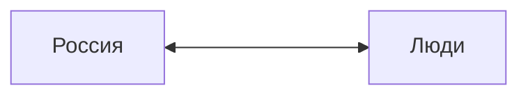
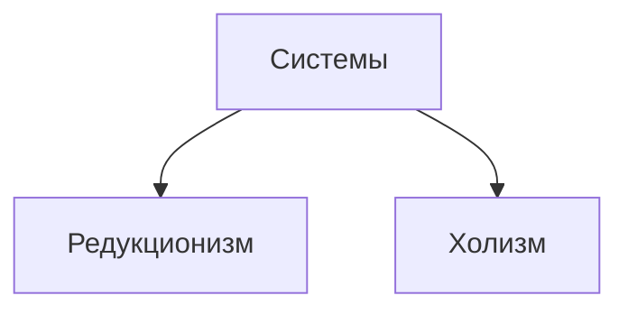
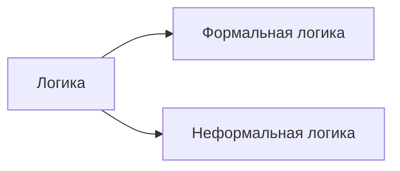
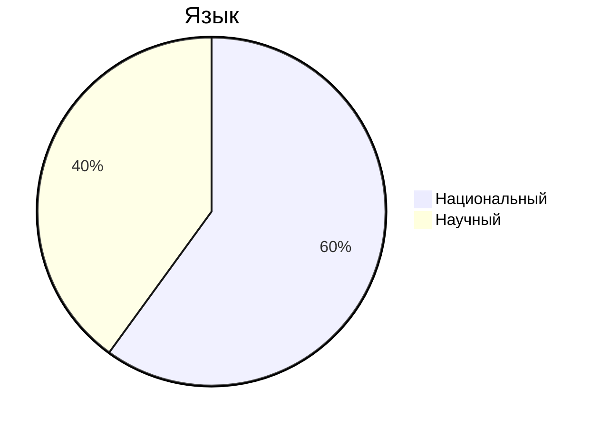

Зубков Николай Андреевич
zubkov@mirea.ru

Россия - сложная соц. полит. система
Люди - элементы этой системы

Редукционизм - система имеет свойство каждого элемента
Холизм - есть свойства, которых нет у элементов

Россия - холизм

-------
Теоретические знания

1) Логика (неформальная)
2) Рациональность (научная рациональность)
3) Язык 

---
## Термины
1) Страна
2) 

