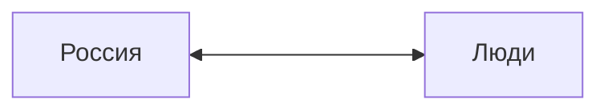
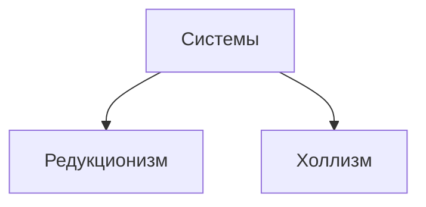

Зубков Николай Андреевич
zubkov@mirea.ru

Россия - сложная соц. полит. система
Люди - элементы этой системы

Редукционизм - система имеет свойство каждого элемента
Холлизм - есть свойства, которых нет у элементов

Россия - холлизм

