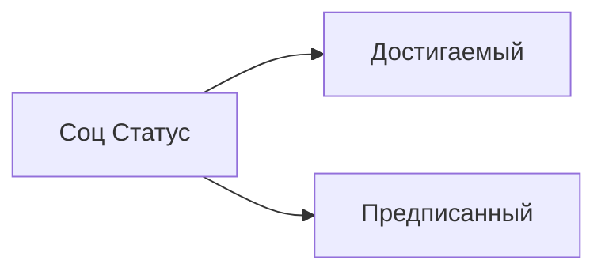

## Героическое действие
1) Аксиологический компонент (аксио - ценность)
2) Социальный компонент

"Образ героя" - соответствует домин. этносу

Социальный статус - позиция в иерархии

```mermaid 
graph LR
a[Соц Статус]-->Достигаемый
a-->Предписанный
```

