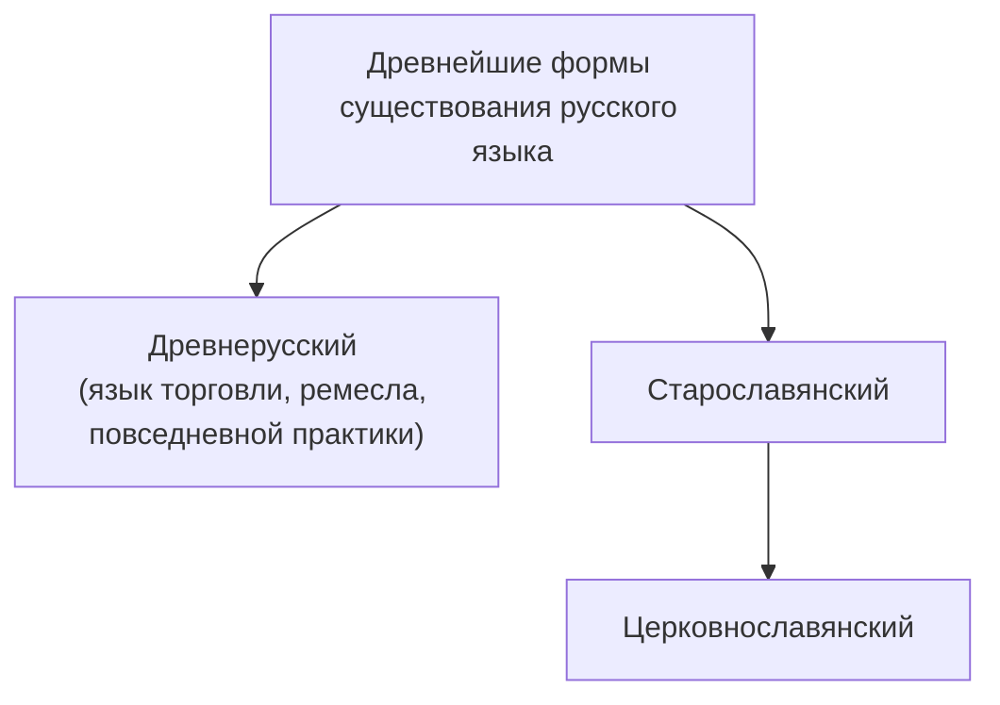

Ульянова Эмилия Фаридовна
ulyanova.emiliya@list.ru

### Литературный язык. Понятие нормы

- История русского литературного языка начинается с письменности.
- Первые достоверные письменные памятники появились после 988г
- Формирование диглоссии - соотношения двух языков

Литературный язык - московский диалект.

В 1326г. митрополит Петр избирает Москву своей резиденцией, и московский говор становится основой литературного языка. 
