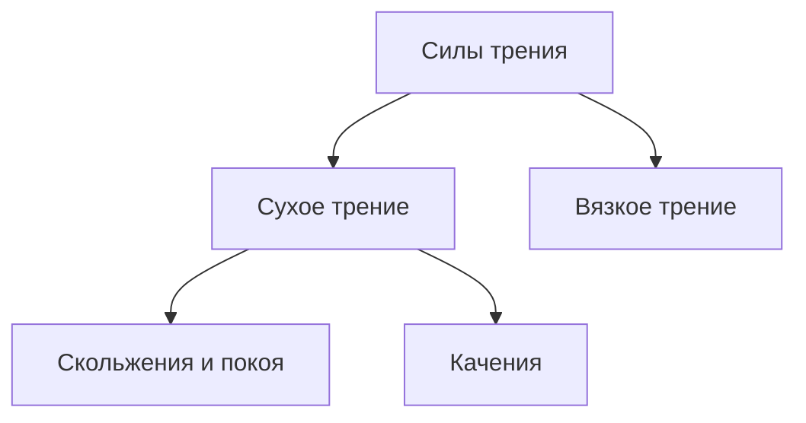

# Вращательное движение
$\phi(t)$ - закон движения
Угол $\phi$ измеряется в радианах
![[Pasted image 20230908090630.png]]

---
![[Pasted image 20230908090735.png]]
$$\phi = \frac{e}{R}$$
Отношение длинны окружности к ее радиусу

---

## Угловая скорость
$\omega$ - угловая скорость
$$\omega = \dot{\phi}=\lim_{\delta t\to 0}(\frac{\delta \phi}{\delta t})$$
Угловая скорость - производная движения по времени
![[Pasted image 20230908091137.png]]
Вектор угловой скорости находится по правилу буравчика

----
## Угловое ускорение

$$\overrightarrow{\beta} = \dot{\overrightarrow{\omega}}$$
Угловое ускорение направлено так же, как и угловая скорость

---

## Связь между линейными и угловыми характеристиками движения

- Между $\overrightarrow{\omega}$ и $\overrightarrow{v}$
![[Pasted image 20230908091737.png]]
$$V = \omega R$$
![[Pasted image 20230908091900.png]]
$$\overrightarrow{V} = [\overrightarrow{\omega}\overrightarrow{R}]$$

---
## Векторное произведение
$$\overrightarrow{C} = [\overrightarrow{A} \overrightarrow{B}]$$
$$C = AB * \sin(\alpha)$$
**Направление вектора $C$ определяется правилом Буравчика**

![[Pasted image 20230908092118.png]]

----

### Связь линейного и углового ускорения

$V = \omega R$
$\dot{V} = \dot{\omega}R$
$\dot{V}$ - тангенциальное ускорение
$\dot{\omega}$ - угловое ускорение
$a_т=\beta * R$

---
### Период обращения
Период можно ввести только, если движение равномерное, при $\omega$ = const

$$2 \pi = \omega * t$$

---

# Динамика

#### Законы Ньютона
1) Существуют  такие системы отсчета, в которых если на тело не действуют другие тела, то оно сохраняет состояние покоя или равномерного прямолинейного движения. Такие системы называются инерциальными
Опыт, показывающий, что земля не является инерциальной системой отсчета. [Почему](https://www.all-fizika.com/article/index.php?id_article=2126)
![[Pasted image 20230908093336.png]]
2) $$\overrightarrow{a} = \frac{\overrightarrow{F}}{m}$$ $$\overrightarrow{F}=m\overrightarrow{a}$$
   1Н = $1$кг$*1\frac{м}{c^2}$

3) ![[Pasted image 20230908094134.png]]
   $\overrightarrow{f}_{12}=-\overrightarrow{f}_{21}$

----
## Силы в механике

В механике рассматриваются три вида сил:
- Гравитационные силы
- Силы упругости
- Силы трения

Гравитационные силы, или силы тяготения - самые универсальные в природе и действуют на все объекты имеющие массу.
Тела взаимодействуют друг с другом на любом расстоянии и с любой массой.
![[Pasted image 20230908094821.png]]
$$F=G\frac{m_1*m_2}{R^2}$$
$G$ - гравитационная постоянная, равная $6.674*10^{-11}$ $H*м^2*кг^{-2}$
Она создана для приведения чисел в нормальные СИ.

-----
## Ускорение свободного падения $g$

![[Pasted image 20230908100130.png]]
$$G\frac{mM}{R^2}=mg$$
$$g=G\frac M{R^2}$$

![[Pasted image 20230908100236.png]]
$$G\frac{M_{солнца}m}{R^2}=m\frac{V^2}{R}$$
$$GM_{солнца}=V^2R$$
Измерение $G$ произвел Генри Кавендиш

----
## Упругие силы

Упругие силы возникают в упругих телах в ответ на деформацию

### Деформация
Существует 4 вида элементарных деформаций

1) Сжатие - растяжение
2) Кручение
3) Изгиб
4) Сдвиг

Закон Гука (применим только к малым деформациям) - $F_{упругости}$ пропорциональна деформации
![[Pasted image 20230908101628.png]]
Работает только тогда, когда $x << l$

$$F_{упругости}=-kx$$
$$k=E\frac S l$$
$E$ - модуль Юнга

----
## Силы трения

Силы трения возникают когда одно тело движется по поверхности другого.

### Трение скольжения и покоя

![[Pasted image 20230908102455.png]]
$$F_{трения}=\mu N$$

### Вязкое трение

Вязкое трение возникает тогда, когда тело движется в жидкости или газе. Вязкое трение зависит от скорости
![[Pasted image 20230908102804.png]]