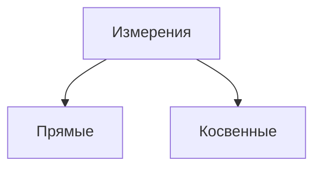

**Плотность**: Распределение массы в пределах тела характери-
зуют величиной, называемой плотностью. Если тело однородно, то его плот-
ность определяется по формуле
$$P = \frac m V$$где $m$ - масса тела, а $V$ - объем

Косвенные - сравнение зависимости величины
Прямые - сравнение величины с единицей измерения

При измерении так же могут возникнуть погрешности. Погрешности бывают трех видов
- Систематические
 Связаны, например, с неправильной установкой измерительного прибора или с неточной его регулировкой.  Такие погрешности в принципе могут быть ис-
ключены введением соответствующих поправок