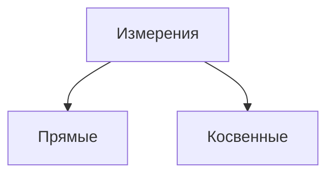

**Плотность**: Распределение массы в пределах тела характери-
зуют величиной, называемой плотностью. Если тело однородно, то его плот-
ность определяется по формуле
$$P = \frac m V$$где $m$ - масса тела, а $V$ - объем

Косвенные - сравнение зависимости величины
Прямые - сравнение величины с единицей измерения

При измерении так же могут возникнуть погрешности. Погрешности бывают трех видов
- Систематические
 Связаны, например, с неправильной установкой измерительного прибора или с неточной его регулировкой.  Такие погрешности в принципе могут быть исключены введением соответствующих поправок
- Приборные
  Связаны с несовершенством любого измерительного инструмента.
  Погрешностью приборов со шкалой является половина цены деления шкалы. Для стрелочных приборов, указывают класс точности.
- Случайные
  Связаны с рядом случайных причин, не зависят от условий измерений. Не устранимы

Для повышения точности результата применяют многократные измерения одной и той же величины. Пусть величина x измерена n раз. Тогда в соответствии с теорией вероятности «истинным» значением измеряемой величины
будет её среднее значение при бесконечно большом n, то есть
$$x = \lim_{n \to \infty}\frac 1 n \sum^n_{i=1}x_i$$
где $x_i$ результат i-го измерения

Как правило, в качестве меры случайной погрешности при многократных
измерениях берут так называемую среднюю квадратичную погрешность, которая для n измерений вычисляется по формуле
$$\trianglex_{кв}$$